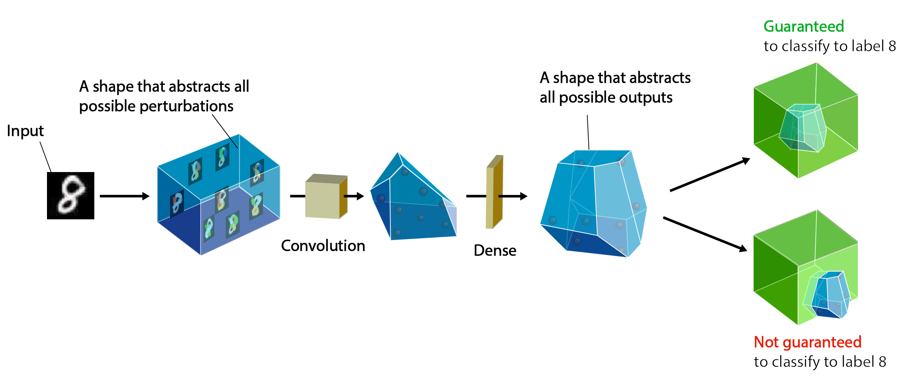

# Implementacija rada: "An Abstract Domain for Certifying Neural Networks"

Autor: Slobodan Jenko

Projekat na kursu "Računarska Inteligencija" na Matematičkom Fakultetu Univerziteta u Beogradu. 

## Uvod

Veštačke neuronske mreže su u poslednjih 15-ak godina donele veliki napredak u najrazličitijim zadacima (računarska vizija, razumevanje prirodnog jezika, robotika...). Medjutim, neuronske mreže su i dalje crne kutije, što ograničava njihovu upotrebu u kontekstima u kojima greške nisu dopustive. Štaviše, pokazano je da se u mnogim domenima neuronske mreže mogu "zavarati" tako što se napravi neprimetna promena u ulaznim podacima [1]. Ovako izmenjeni ulazi se zovu Adversarijalni napadi. Otkriće ovakvih napada je dovelo do razvoja različitih metoda koje formalno dokazuju da neuronska mreža zadovoljava odredjeno svojstvo (npr. robusnost na adversarijalne napade). Neke od tih metoda su zasnovane na SMT rešavačima [2], linearnim aproksimacijama i apstraktnoj interpretaciji [3], [4], [5]. Rad "Abstract Domain for certifying Neural Networks" je primer primene apstraktne interpretacije za dokazivanje robusnosti na adversarijalne napade.  

Formalno, problem odredjivanja robusnosti na adversarijalne napade se definiše tako što zadamo region oko ulazne instance u kojem smo sigurni da se tačan izlaz neće menjati. Recimo da imamo problem binarne klasifikacije slika na one koje sadrže i one koje ne sadrže mačke i da je $X$ slika mačke dimenzije $64 \times 64$ sa vrednostima iz intervala $[0,255]$. Možemo sa sigurnošću tvrditi da će klasa bilo koje slike $X' = X + \epsilon$, gde je $\epsilon$ šum dimenzije $64 \times 64$ sa normom $\| \epsilon \|_{\infty} <= 1$ (vrednost svakog piksela smo povećali ili smanjili najviše za $1$).

## Rešenje

### Apstraktna interpretacija

Apstraktna interpretacija je tehnika inicijalno razvijena u oblasti verifikacije softvera. Ideja je da skup vrednosti od interesa aproksimiramo nadskupom jednostavnijeg oblika. Na osnovu svojstava nadskupa možemo zaključiti nešto o svojstvima originalnog skupa.

Vratimo se na primer klasifikacije slike mačke. Jednačine:
$$X' = X + \epsilon$$
$$\| \epsilon \|_{\infty} \leq 1$$
Nam daju hiperkocku dimenzije slike. U centru hiperkocke je originalna slika $X$. Želimo da dokažemo da će neuronska mreža svaku tačku iz hiperkocke klasifikovati kao klasu mačka. Formalno, želimo da pokažemo da će slika hiperkocke pri preslikavanju zadatom neuronskom mrežom $N\colon \mathbb{R}^{4096} \mapsto \mathbb{R}$ biti podskup intervala $[0.5,1]$ (te izlaze proglašavamo za klasu mačka). 

Pošto je previše komplikovano razmatrati na koji način cela neuronska mreža transformiše hiperkocku, analiziraćemo efekat sloj po sloj, tj. predstavićemo mrežu kao kompoziciju slojeva $N = N_1 \circ N_2 \circ ... \circ N_k$, gde je $k$ broj slojeva u mreži. Kako izlazi pojedinačnih slojeva mogu biti kompleksni (nekonveksni, nelinearni), izlaz svakog sloja aproksimiramo hiperkockom koja je nadskup pravog izlaza $N_k^* \approx N_k$. Kao izlaz poslednjeg sloja dobijamo interval $[a,b]$. Ako je $a \geq 0.5$ ($N_k^* \geq 0.5$), znamo da je i $N_k \geq 0.5$, pa mreža zaista ispravno klasifikuje sve slike iz početne hiperkocke. Ako je $a \leq 0.5$, aproksimirani interval neće ceo biti klasifikovan kao mačka, ali na osnovu toga ne možemo da zaključimo da mreža nije robusna za dati ulaz, jer je pravi izlazni interval podskup aproksumiranog.

### DeepPoly

## Eksperimentalni rezultati

## Zaključak

## Reference

[1]: Ian Goodfellow, Jonathon Shlens, and Christian Szegedy. 2015. Explaining and Harnessing Adversarial Examples  
[2]: Guy Katz, Clark W. Barrett, David L. Dill, Kyle Julian, and Mykel J. Kochenderfer. 2017. Reluplex: An Efficient SMT Solver
for Verifying Deep Neural Networks.  
[3]: Timon Gehr, Matthew Mirman, Dana Drachsler-Cohen, Petar Tsankov, Swarat Chaudhuri, and Martin Vechev. 2018. AI2:
Safety and Robustness Certification of Neural Networks with Abstract Interpretation
[4]: Matthew Mirman, Timon Gehr, and Martin Vechev. 2018. Differentiable Abstract Interpretation for Provably Robust Neural
Networks  
[5]: Gagandeep Singh, Timon Gehr, Matthew Mirman, Markus Püschel, and Martin Vechev. 2018a. Fast and Effective Robustness
Certification
