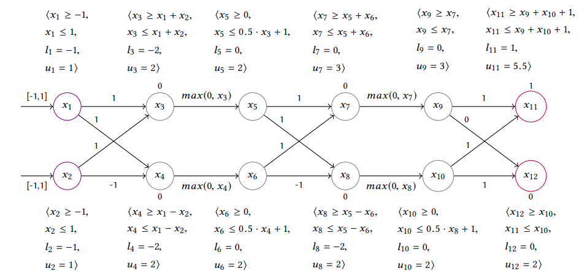
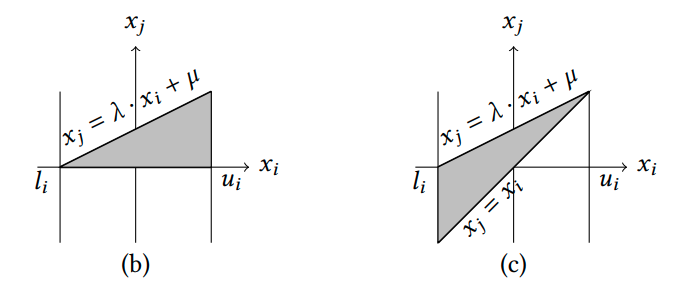
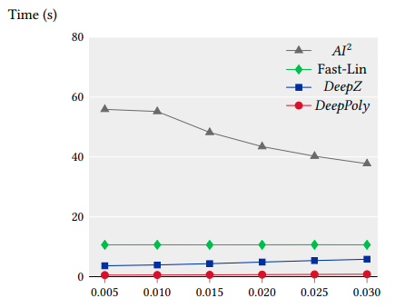

# Implementacija rada: "An Abstract Domain for Certifying Neural Networks"

**Autor**: Slobodan Jenko

Projekat sa kursa "Računarska Inteligencija" na Matematičkom Fakultetu Univerziteta u Beogradu. Ovaj projekat je takodje deo kursa "Reliable and Interpretable Artificiall Intelligence" na fakultetu ETH u Zirihu.

Implementicija rada \[6\]

## Uvod

Veštačke neuronske mreže su u poslednjih 15-ak godina donele veliki napredak u najrazličitijim zadacima (računarska vizija, razumevanje prirodnog jezika, robotika...). Medjutim, neuronske mreže su i dalje crne kutije, što ograničava njihovu upotrebu u kontekstima u kojima greške nisu dopustive. Štaviše, pokazano je da se u mnogim domenima neuronske mreže mogu "zavarati" tako što se napravi neprimetna promena u ulaznim podacima \[1\]. Ovako izmenjeni ulazi se zovu Adversarijalni napadi. Otkriće ovakvih napada je dovelo do razvoja različitih metoda koje formalno dokazuju da neuronska mreža zadovoljava odredjeno svojstvo (npr. robusnost na adversarijalne napade). Neke od tih metoda su zasnovane na SMT rešavačima \[2\], linearnim aproksimacijama i apstraktnoj interpretaciji [3], [4], [5]. Rad "Abstract Domain for certifying Neural Networks" je primer primene apstraktne interpretacije za dokazivanje robusnosti na adversarijalne napade.

Formalno, problem odredjivanja robusnosti na adversarijalne napade se definiše tako što zadamo region oko ulazne instance u kojem smo sigurni da se tačan izlaz neće menjati. Recimo da imamo problem binarne klasifikacije slika na one koje sadrže i one koje ne sadrže mačke i da je $X$ slika mačke dimenzije $64 \times 64$ sa vrednostima iz intervala $[0,255]$. Možemo sa sigurnošću tvrditi da će klasa bilo koje slike $X' = X + \epsilon$, gde je $\epsilon$ šum dimenzije $64 \times 64$ sa normom $\| \epsilon \|_{\infty} \leq 1$ takodje biti mačka (vrednost svakog piksela smo povećali ili smanjili najviše za $1$).

## Rešenje

### Apstraktna interpretacija za neuronske mreže

Apstraktna interpretacija je tehnika inicijalno razvijena u oblasti verifikacije softvera. Ideja je da skup vrednosti od interesa aproksimiramo nadskupom jednostavnijeg oblika. Na osnovu svojstava nadskupa možemo zaključiti nešto o svojstvima originalnog skupa.

Vratimo se na primer klasifikacije slike mačke. Jednačine:
$$X' = X + \epsilon$$
$$\| \epsilon \|_{\infty} \leq 1$$
Nam daju hiperkocku dimenzije slike. U centru hiperkocke je originalna slika $X$. Želimo da dokažemo da će neuronska mreža svaku tačku iz hiperkocke klasifikovati kao klasu mačka. Formalno, želimo da pokažemo da će slika hiperkocke pri preslikavanju zadatom neuronskom mrežom $N\colon \mathbb{R}^{4096} \mapsto \mathbb{R}$ biti podskup intervala $[0.5,1]$ (te izlaze proglašavamo za klasu mačka).

Pošto je previše komplikovano razmatrati na koji način cela neuronska mreža transformiše hiperkocku, analiziraćemo efekat sloj po sloj, tj. predstavićemo mrežu kao kompoziciju slojeva $N = N_1 \circ N_2 \circ ... \circ N_k$, gde je $k$ broj slojeva u mreži. Kako izlazi pojedinačnih slojeva mogu biti kompleksni (nekonveksni, nelinearni), izlaz svakog sloja aproksimiramo hiperkockom koja je nadskup pravog izlaza $N_k^* \approx N_k$. Kao izlaz poslednjeg sloja dobijamo interval $[a,b]$. Ako je $a \geq 0.5$ ($N_k^* \geq 0.5$), znamo da je i $N_k \geq 0.5$, pa mreža zaista ispravno klasifikuje sve slike iz početne hiperkocke. Ako je $a \leq 0.5$, aproksimirani interval neće ceo biti klasifikovan kao mačka, ali na osnovu toga ne možemo da zaključimo da mreža nije robusna za dati ulaz, jer je pravi izlazni interval podskup aproksumiranog.

Ovaj primer demonstrira jedno važno svojstvo tehnika zasnovanih na apstraktnoj interpretaciji: one mogu dokazati da je svojstvo zadovoljeno, ali ne mogu dokazati da nije zadovoljeno.

### DeepPoly metod

Ideja ovog metoda je da simboličku vrednost svakog neurona odzgo i odozdo ograničimo linearnom kombinacijom simboličkih vrednosti neurona iz prethodnog sloja. Potom, radi dobijanja precizne ocene gornje i donje granice za vrednost nekog neurona $N_{ki}^*$ za datu ulaznu hiperkocku $X'$, u simbolička ograničenja za $N_{ki}^*$ ubacujemo formule za simbolička ograničenja prethodnih slojeva, dok za $N_{ki}^*$ ne dobijemo formule koje zavise samo od ulaznih neurona. Iz tako dobijenih formula lako očitavamo ocenjene granice.

Pogledajmo kako to izgleda na konkretnom primeru. Svaki sloj je zapravo razdvojen na dva sloja: linearni i aktivacionu funkciju. Ova konkretna mreža koristi ReLu aktivacionu funkciju. Mrežu analiziramo sloj po sloj. Ograničenja za neurone koji su izlaz linearnog sloja formiramo jednostavno (videti sliku) i ova ograničenja ne vrše aproksimaciju.

ReLu sloj je zanimljiviji. Označimo $y = ReLu(x)$, gde je $x$ simbolička promenljiva kojoj znamo aproksimiranu donju i gornju granicu ($l_x$ i $u_x$). Naglasimo da ovde svaki neuron zavisi samo od jednog neurona iz prethodnog sloja, pa u daljoj diskusiji razmatramo samo ta dva neurona. Treba da razmotrimo tri slučaja:

1. $u_x \leq 0 \implies y = 0$
2. $l_x \geq 0 \implies y = x$
3. $l_x < 0 \; \land \; u_x > 0$

Slučajevi 1 i 2 su trivilani, pa su rešenja gore i navedena, i u ovim slučajevima ne vršimo aproksimaciju. U 3. slučaju dobijamo nelinearnu funkciju, pa u ovom slučaju funkciju $y = ReLu(x)$ na $[l_x, u_x]$ moramo aproksimirati trouglom koji je sadrži. Na narednoj slici su prikazana dva načina na koji to možemo uraditi. U radu se ispituju oba i bira onaj koji da je trougao manje površine.

## Eksperimentalni rezultati

U radu je DeepPoly uporedjen sa tri druga pristupa na različitim mrežama.

Kako sam ja implementirao samo podršku sa potpuno povezane mreže, fokusiraću se na njih. U radu su analize nad potpuno povezanim mrežama su pokretali koristeći 3.3 GHz 10 core Intel i9-7900X Skylake CPU sa 64 GB RAM-a. Ja sam koristio Intel Core i5-4460 @ 3.20GHz sa 8GB RAM-a. Sve sam implementirao koristeći samo numpy biblioteku. Svoje resenje sam testirao na test primerima datim u opisu projekta (potpuno povezane mreže sa 50, 150, 200, 250, 300, 400 i 500 skrivenih neurona).

Svoju implementaciju DeepPoly metoda uporediti sa svojom implementacijom propagacije hiperkocki. Preciznost evaluiram na test primerima datim kao deo projekta. Implementacija zasnovana na propagaciji hiperkocki daje tačan odgovor u 5/14 test primera, a DeepPoly daje tačan odgovor u 8/14 test primera. Deo test primera mi verovatno ne prolazi jer sam implementirao samo jednu opciju za izbor trougla.

Metod zasnovan na hiperkocki je znatno brži. Ukupna vremena izvršavanja na svim primerima su 0.22 s i 157.68 s. DeepPoly se izvršava 18 sekundi po ulazu za najveću ulaznu mrežu, sa 500 skrivenih neurona. Ovo je značajno sporije od rezultata postignutih u radu. Sa grafika 4 se vidi da njihova implementacija za mrežu sa 600 skrivenih neurona radi mnogo brže.

Uzrok razlike u brzini je verovatno:

1. Brži hardver
2. Paralelizacija: DeepPoly se prirodno može paralelizovati jer su svi neuroni u sloju nezavisni, a njihov CPU ima 10 jezgara
3. Oni koriste optimizovanu biblioteku za rad sa ovakvim objektima napisanu u C++-u. (http://elina.ethz.ch/)

## Zaključak

Oblast verifikacije svojstava neuronskih mreža je počela da se aktivno razvija tek u prethodnih nekoliko godina. Iako su za to vreme ove metode zančajno napredovale, još nisu dovoljno moćne da obrade veliki deo produkcionih neuronskih mreža.

Za više detalja, pogledajte \[6\] na https://files.sri.inf.ethz.ch/website/papers/DeepPoly.pdf.

## Reference

[1]: Ian Goodfellow, Jonathon Shlens, and Christian Szegedy. 2015. Explaining and Harnessing Adversarial Examples  
[2]: Guy Katz, Clark W. Barrett, David L. Dill, Kyle Julian, and Mykel J. Kochenderfer. 2017. Reluplex: An Efficient SMT Solver
for Verifying Deep Neural Networks.  
[3]: Timon Gehr, Matthew Mirman, Dana Drachsler-Cohen, Petar Tsankov, Swarat Chaudhuri, and Martin Vechev. 2018. AI2:
Safety and Robustness Certification of Neural Networks with Abstract Interpretation
[4]: Matthew Mirman, Timon Gehr, and Martin Vechev. 2018. Differentiable Abstract Interpretation for Provably Robust Neural
Networks  
[5]: Gagandeep Singh, Timon Gehr, Matthew Mirman, Markus Püschel, and Martin Vechev. 2018a. Fast and Effective Robustness
Certification
[6]: Gagandeep Singh, Timon Gehr, Markus Püschel, and Martin Vechev. An abstract domain for certifying neural networks
